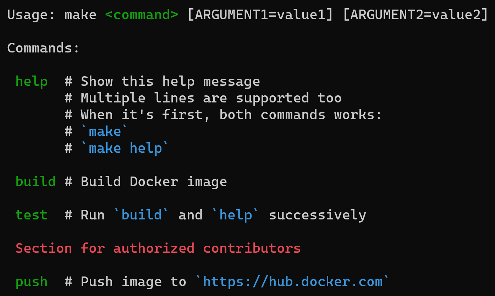

# make-help

Is it crazy enough to show the `Makefile` help via [Docker](https://www.docker.com)? This is exactly what I did. 😋

## Why?

I often use [`make`](https://www.gnu.org/software/make) as a uniform way to document tasks for cross-language projects.
For example, `make test` in any project will run tests, `make build` will always rebuild Docker images.
In any project, the first thing I do is go to the `Makefile` to remember how to work here.

But it will be much easier not to read the entire `Makefile`, but to run `make help` or even just `make` and see all the information I need.

So this project aims to provide a very simple way to achieve it.

## How?

Just add this to the top of the `Makefile`:

```make
# Show this help
help:
  @cat $(MAKEFILE_LIST) | docker run --rm -i xanders/make-help
```

That's all. Now you can use both `make` and `make help` commands. No additional dependencies are required (with except for [Docker](https://www.docker.com), obviously).

Add comments to all public tasks. You can use multi-line comments as well as code examples in `` `backticks` ``.
No special syntax required, just use single `#` as usual.

Thanks to [@muuvmuuv](https://github.com/muuvmuuv) ([#1](https://github.com/Xanders/make-help/issues/1)), you can also add sections to a large `Makefile` like this:

```make
##
## Section name (one line)
##
```

**Please see the example in [this project `Makefile`](Makefile).**



*Screenshot from Windows Terminal, so this is a relatively platform-independent solution.*

## What??

`@` before `cat` means "Do not show this line when I run the task".

`MAKEFILE_LIST` is a variable with current `Makefile` path. `$(...)` used to substitute variable name with it's value.

`cat` with pipe (`|`) puts the file contents into the next command.

`--rm` means "Delete Docker container immediately after finishing".

`-i` means "Allow to get information from Docker's standard input".

`xanders/make-help` is a name of [the image at Docker Hub](https://hub.docker.com/r/xanders/make-help).

So we grab current `Makefile` and push to the container with a program.
It processes the file and outputs usage help with the tasks comments.

The image [is built from scratch](https://docs.docker.com/develop/develop-images/baseimages/#create-a-simple-parent-image-using-scratch)
and is as small as even possible in Docker: 929.62 **KB** compressed (two layers).

I used [extra-fast](https://github.com/kostya/crystal-benchmarks-game) [Crystal programming language](https://crystal-lang.org) with [static linking](https://crystal-lang.org/reference/using_the_compiler/index.html#creating-a-statically-linked-executable) on [Alpine-based compiler](https://crystal-lang.org/2020/02/02/alpine-based-docker-images.html) at [build stage](https://docs.docker.com/develop/develop-images/multistage-build).

So it will be fast enough and also tiny on disk.

## Alternatives

There is a lot of similar projects in different languages, for example:

* A **lot** of [Bash solutions](https://gist.github.com/prwhite/8168133)
* [Go](https://github.com/Songmu/make2help)
* [JavaScript](https://github.com/ianstormtaylor/makefile-help)
* [Python](https://github.com/mrdor44/MakeHelp)
* [Perl](https://github.com/christianhujer/makehelp)

You even can use this one-line Ruby version:

```make
# Show this help
help:
  @cat $(MAKEFILE_LIST) | ruby -e "input = ARGF.read; indent = input.scan(/^\w[^:]*:/).map(&:size).max + 1; puts \"\nUsage: make \033[32m<command>\033[0m [ARGUMENT1=value1] [ARGUMENT2=value2]\n\nCommands:\n\", input.scan(/((?:^# .+\n)+)^([^:]+):/).map { |comments, command| \"\n \033[32m#{command.ljust indent}\033[0m#{comments.lines.first.strip}#{comments.lines[1..-1].map { |comment| \"\n \" + ' ' * indent + comment }.join}\".gsub(/\`.+?\`/) { |code| \"\033[36m#{code}\033[0m\" } }, ''"
```

Most of them are 1) hard to read (Bash, Ruby one-liner), or 2) add dependencies to the project (language `X` libraries).

Docker is de-facto standard tool for developers nowadays, so I don't think of it as of dependency.

So I think my solution may be useful in real-world. Feel free to use it in your projects! 🖖